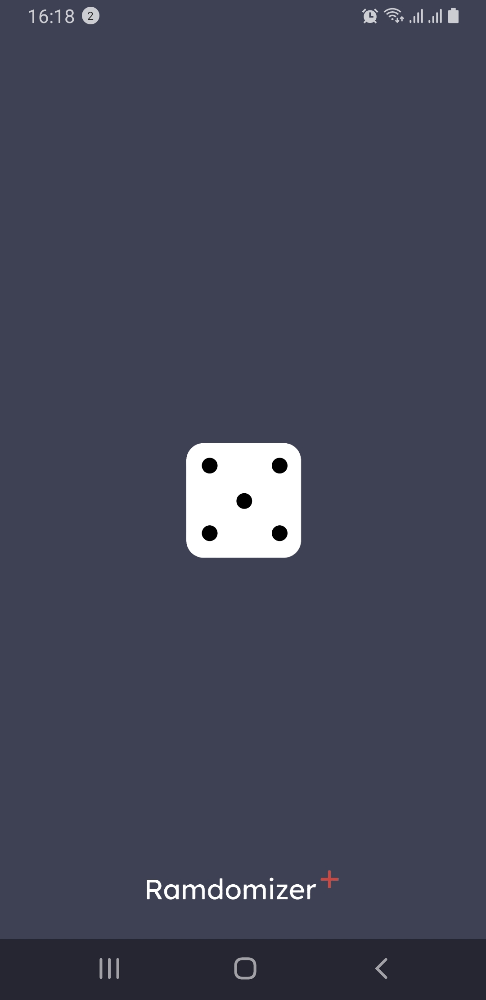

# Ramdomizer+

First dive into modern Android **Clean Architecture & Jetpack Compose**  
**Kotlin | Compose | DataStore | Koin DI | Clean Architecture | MVVM**

A tiny playground-app that helps you decide anything at the press of a button –  
roll dice, flip a *yes / no*, or pick a random number – all wrapped in a crisp
Material 3 UI.

---

## Features

- **Three Randomizers in One**
  - *Dice* — roll up to three dice at once and watch them animate on screen.
  - *Yes / No* — get an instant “YES” or “NO” answer with a friendly graphic.
  - *Number* — generate an integer between user-defined **from / to** bounds.

